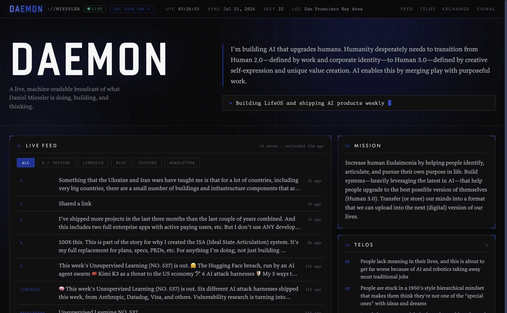

# Daemon

A personal daemon — a live, machine-readable broadcast of who you are, what you're doing, and what you care about.

Your daemon is a public dashboard plus a public API of yourself: your mission, current status, live activity feed, projects, predictions, offerings, and preferences — all served from one place, kept fresh automatically, and readable by both humans and AI agents.



Live example: [daemon.danielmiessler.com](https://daemon.danielmiessler.com)

## What you get

- **A technical dashboard site** — dark instrument-panel design, live telemetry bar, boot-sequence load
- **A live activity feed** — a Cloudflare Worker polls your public sources (blog RSS, YouTube, GitHub, X, Beehiiv newsletter, LinkedIn) every 30 minutes and serves them at `/feed.json`, with per-source tabs on the page
- **TTL'd ephemera** — status, location, and time-bound offerings carry `expires` stamps and are stripped **at the edge** once stale; your daemon can never assert last month's plans
- **A location safety gate** — a deterministic pre-deploy check blocks street addresses, ZIP codes, coordinates, your home-area strings, and unapproved real-time presence phrasing
- **Machine-readable endpoints** — `/daemon-data.json` and `/feed.json`, stable and additive, for agents and daemon-to-daemon protocols

## Architecture

Two repos, one deploy:

1. **Daemon (this repo, public)** — the framework: site, worker, styling. Fully generic; all identity comes from your data file.
2. **Your instance (private repo you create)** — `daemon-data.json` (your actual content), `DeployGate.ts`, and `deploy.sh`. Starters live in [`instance-template/`](instance-template/).

At deploy time your instance copies `daemon-data.json` into `cms/public/`, builds VitePress, deploys the Worker with the site as static assets, and deletes the copy. Your personal data is never committed to the public framework.

The Worker then does the live work:

- `/daemon-data.json` — served with expired ephemera stripped at request time
- `/feed.json` — aggregated from the `feeds` you configure in your data file, cached in KV
- a 30-minute cron keeps the feed fresh; everything else is static

## Setup

```bash
# 1. Fork and clone this repo
git clone https://github.com/YOUR_USERNAME/Daemon ~/Projects/daemon
cd ~/Projects/daemon && bun install

# 2. Create your private instance repo from the starters
mkdir ~/Projects/daemon-instance
cp instance-template/* ~/Projects/daemon-instance/
cp cms/public/daemon-data.example.json ~/Projects/daemon-instance/daemon-data.json
# → edit daemon-data.json with your content
# → edit DeployGate.ts HOME_AREA with your street/city strings

# 3. Create the KV namespace for the feed cache
bunx wrangler kv namespace create FEED_KV
# → paste the id into wrangler.toml

# 4. Optional secrets for extra feed sources
echo "$X_BEARER_TOKEN"    | bunx wrangler secret put X_BEARER_TOKEN     # X/Twitter posts
echo "$BEEHIIV_API_KEY"   | bunx wrangler secret put BEEHIIV_API_KEY    # Beehiiv newsletter
echo "$APIFY_API_KEY"     | bunx wrangler secret put APIFY_API_KEY      # LinkedIn posts

# 5. Ship it
bash ~/Projects/daemon-instance/deploy.sh
```

## Feed sources

Configure in `daemon-data.json` → `feeds`:

| type | needs | notes |
|------|-------|-------|
| `rss` | `url` | Any RSS/Atom feed — blog, YouTube channel feed, podcasts |
| `github` | `user` | Public events, no auth needed |
| `x` | `username`, `user_id` + `X_BEARER_TOKEN` secret | Your own posts via the X API |
| `beehiiv` | `publication_id` + `BEEHIIV_API_KEY` secret | Beehiiv blocks RSS scrapers; the official API works |
| `linkedin` | `profile_url` + `APIFY_API_KEY` secret | Via the `supreme_coder/linkedin-post` Apify actor, cached 24h. The actor bills per scraped post — the `max` field caps it |

## Ephemera and the safety gate

Anything time-bound carries an ISO `expires` field: `status`, `now` (via `now_meta`), offerings with temporal language, and any non-default `current_location`. Three layers enforce it: `DeployGate.ts` blocks a deploy of stale/ungated data, the Worker strips expired items at serve time, and the page hides them client-side.

The gate also refuses to ship street addresses, ZIP codes, coordinates, your configured home-area strings, credentials, and real-time presence phrasing ("tonight", "I'm at") unless the item explicitly sets `realtime_approved: true` — for events where you *want* to be findable.

## Fonts

The design references the Butterick typefaces (Advocate, Concourse, Valkyrie, Triplicate). Those are commercial fonts and are **not included** — buy them at [practicaltypography.com](https://practicaltypography.com), drop the woff files in `cms/public/fonts/`, or swap the `@font-face` blocks in `DaemonDashboard.vue` for free alternatives (JetBrains Mono for the mono roles, Fraunces or Newsreader for body). The CSS falls back gracefully.

## Local development

```bash
cp cms/public/daemon-data.example.json cms/public/daemon-data.json
bun run dev
```

(The gitignore keeps `cms/public/daemon-data.json` out of the repo.)
